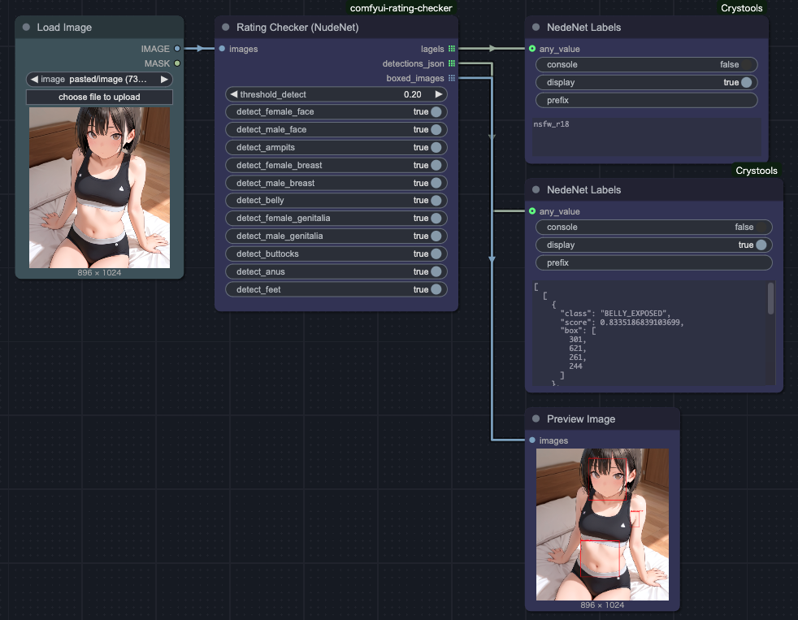
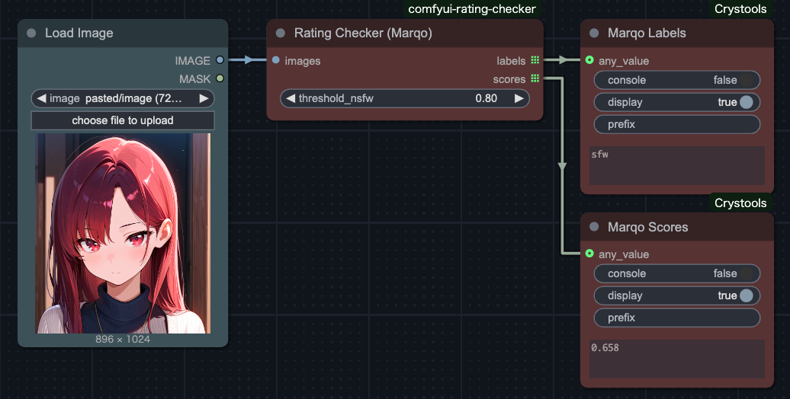

# ComfyUI Rating Checker

[[日本語]](./README_JP.md)

This is a custom node for ComfyUI that classifies images as NSFW (Not Safe For Work).

## Feature

This node is designed especially for classifying NSFW content in illustrated images.

While existing similar nodes perform well for real human photos, they tend to classify anime-style illustrations as NSFW even when there is minimal nudity. Additionally, distinguishing between R15 and R18 categories is often difficult.

To address these issues, `Rating Checker (NudeNet)` combines an object detection model (NudeNet) with an NSFW classification model to categorize images into three labels: `SFW`, `NSFW (R15)`, and `NSFW (R18)`.

## Installation

### ComfyUI Manager

Search for `ComfyUI Rating Checker`.

### Manual

Clone the repository into your `custom_nodes` directory:

```bash
git clone https://github.com/tighug/comfyui-rating-checker.git
```

## Usage

This package includes three nodes for NSFW rating. The primary node is the NudeNet version, but the others (created during evaluation) are also included.

### Rating Checker (NudeNet)

Classifies images into the following three labels based on these conditions:

- `nsfw_r18`: At least one of the following body parts is detected with `detect_[body part] = True`:

  - armpits
  - female_breast
  - male_breast
  - female_genitalia
  - male_genitalia
  - belly
  - buttocks
  - anus
  - feet

- `nsfw_r15`: Not `nsfw_r18`, but `nsfw_score > threshold_nsfw`
- `sfw`: Does not meet any of the above conditions



Models used:

- [notAI-tech/NudeNet](https://github.com/notAI-tech/NudeNet/tree/v3)
- [GantMan / nsfw_model](https://github.com/GantMan/nsfw_model)

### Rating Checker (GantMan)

Classifies images into the following five labels:

- `drawings`: Illustrations
- `hentai`: Anime or manga-style content
- `neutral`: General-purpose images
- `porn`: Real-world explicit content
- `sexy`: Images with a sexual vibe


Useful for distinguishing between real images and illustrations and for general NSFW classification.

Model used:

- [GantMan / nsfw_model](https://github.com/GantMan/nsfw_model)

### Rating Checker (Marqo)

Calculates an NSFW score from the image and outputs it as `scores`. It also performs binary classification (`sfw` / `nsfw`) using `threshold_nsfw`, and outputs the result as `ratings`.



Model used:

- [Marqo/nsfw-image-detection-384](https://huggingface.co/Marqo/nsfw-image-detection-384)

## License

[MIT](./LICENSE)
