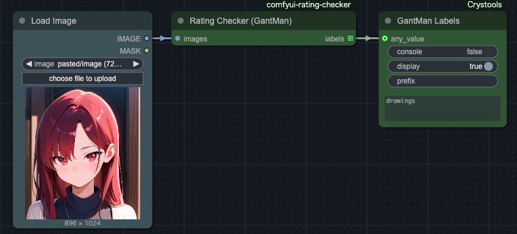

# ComfyUI Rating Checker

ComfyUI の画像を NSFW (Not Safe For Work) 分類するためのカスタムノードです。

## Feature

特にイラスト系の画像の NSFW 判定を目的としたノードです。

存在する類似ノードは実写の人物画像に対して高精度ですが、アニメ系イラストは肉体露出が少ない場合でも NSFW に分類されやすく、さらに小カテゴリの判別 (R15 / R18) も困難でした。

上記の課題を解決するために、`Rating Checker（NudeNet）`は物体検出モデル(NudeNet) とスコア計算モデル(Marqo)を組み合わせ、「SFW / NSFW (R15) / NSFW (R18)」の 3 ラベルに分類します。

## Installation

### ComfyUI Manager

未対応。

### Manual

`custom_nodes`ディレクトリ内にクローンしてください。

```bash
git clone　https://github.com/tighug/comfyui-eagle-feeder.git
```

## Usage

NSFW レーティング用に 3 つのノードが含まれます。主には NudeNet 版を使用しますが、検証過程で作成した他の 2 ノードも同梱しています。

### Rating Checker (NudeNet)

下記 3 ラベルと条件で分類します。

- `nsfw_r18` : `detect_[body part] = True`の部位を一つでも検出
  - armpits : 脇
  - female_breast : 女性の胸
  - male_breast : 男性の胸
  - female_genitalia : 女性器
  - male_genitalia : 男性器
  - belly : 腹
  - buttocks : 尻
  - anus : 肛門
  - feet : 足
- `nsfw_r15` : `nsfw_r18`でなく、`nsfw_score > threashold_nsfw`
- `sfw` : 上記に当てはまらない


使用モデル:

- [notAI-tech/NudeNet](https://github.com/notAI-tech/NudeNet/tree/v3)
- [Marqo/nsfw-image-detection-384](https://huggingface.co/Marqo/nsfw-image-detection-384)

### Rating Checker (GantMan)

下記の 5 ラベルで分類します。

- `drawings` : イラスト
- `hentai` : アニメ、漫画
- `neutral`: 一般的な画像
- `porn` : 実写の性的画像
- `sexy`　: 性的な雰囲気を持つ画像



アニメイラストは`drawings`か`hentai`に分類されますが、水着や下着姿でなくても`hentai`に分類されることが多いため、イラスト特化の分類には向きません。実写とイラストの判別や、実写画像の NSFW 判定には有効です。

使用モデル:

- [GantMan / nsfw_model](https://github.com/GantMan/nsfw_model)

### Rating Checker (Marqo)

画像の NSFW スコアを算出し、`scores`として出力します。また、`threshold_nsfw`による 2 値分類 (`sfw` /`nsfw`)を行い、`ratings`として出力します。


使用モデル:

- [Marqo/nsfw-image-detection-384](https://huggingface.co/Marqo/nsfw-image-detection-384)

## License

[MIT](./LICENSE)
